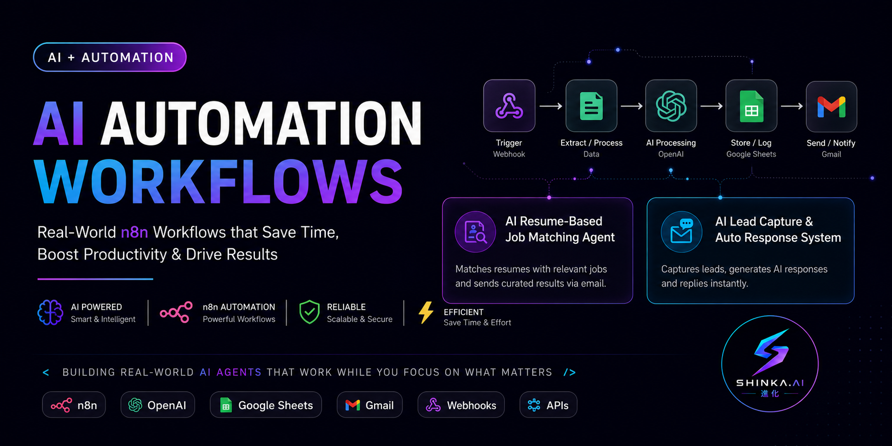

<p align="center">
  
</p>

---

# 🚀 AI Automation Workflows (n8n + AI Agents)


🚀 Build AI agents that automate real-world tasks like job searching and lead handling — powered by n8n, OpenAI, and APIs.


---

## 🔥 Workflows

### 🧠 AI Resume-Based Job Matching Agent

Finds relevant jobs based on a user's resume and sends them via email.

📁 Folder: [job-matching-agent](./workflows/job-matching-agent/)


---

### 📩 AI Lead Capture & Auto Response System

Captures leads, generates AI responses, and sends instant replies.

📁 Folder: [lead-capture-agent](workflows/lead-capture-agent/)


###🎬 AI YouTube Content Repurposer

Transforms a single YouTube video into multiple types of content automatically using AI.

✨ Generates:

✍️ LinkedIn Post
📸 Instagram Caption + Reel Script
🐦 Twitter Thread
📝 Blog Article
📧 Sends everything directly to email

📁 Folder: youtube-content-repurposer

---

## ⚙️ Tech Stack

* n8n (Workflow Automation)
* OpenAI
* Gmail
* Google Sheets
* Remotive API
* Webhooks

---

## 🚀 How to Use

1. Open any workflow folder
2. Import the `.json` file into n8n
3. Add your API credentials
4. Configure required nodes
5. Run or activate the workflow

---

## 📂 Project Structure

```bash
ai-automation-workflows/
├── workflows/lead-capture-agent/
├── workflows/job-matching-agent/
```

---

## 💡 About This Project

This repository is part of my journey of building real-world AI agents and automation workflows.

Focused on:

* Practical use cases
* Developer-friendly automation
* Scalable AI systems
* Building in public

---

## 🔗 Connect & Follow

📸 Instagram: https://www.instagram.com/shinka_6c

🎥 YouTube: https://youtube.com/@shinka-6c

💬 YouTube Community: https://www.youtube.com/@shinka-6c/community

🚀 Follow along as I build AI workflows, automation systems, and real-world AI agents.

---

## ⭐ Support

If you find this useful, consider giving a star ⭐

---

## 📌 Author

Built by **Chandu (Shinka-6C)** 🚀
